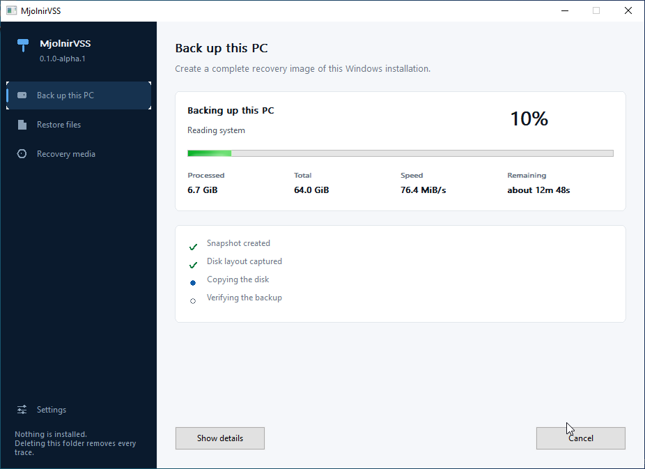
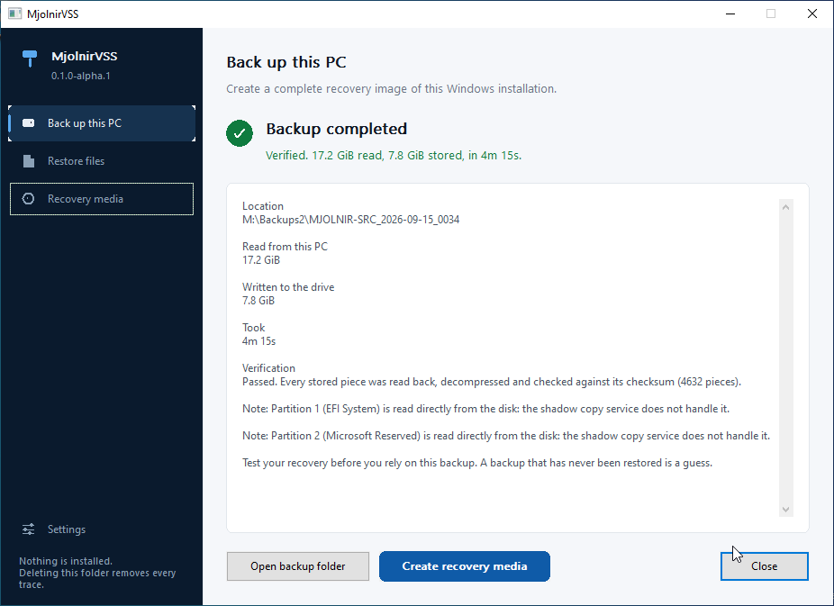

# MjolnirVSS

**Portable bare metal backup and recovery for Windows — no agent, no driver, no service.**

MjolnirVSS images a whole Windows system disk while Windows is running, and
writes that image back onto a blank replacement disk after the original has
failed. One executable, run from a folder. Delete the folder and nothing of it
remains.


---

## Status: early alpha

| | |
|---|---|
| **Version** | `0.1.0-alpha.2` — see [`CHANGELOG.md`](CHANGELOG.md) |
| **Download** | [v0.1.0-alpha.2](https://github.com/carlbomsdata/MjolnirVSS/releases/tag/v0.1.0-alpha.2), a portable folder for 64 bit Windows, or [build it yourself](#building) |
| **Tested end to end** | Backup, verify, restore and boot, on Windows 10, Windows 11, Server 2019 and Server 2025 |
| **Licence** | GPL-3.0-or-later |

Windows 10 22H2, Windows 11 24H2, Server 2019 and Server 2025 have each been
backed up live, verified, restored onto a blank disk from the recovery wizard,
and started unaided. Each restored machine matched 12 of 12 file hashes and kept
every partition's identifier, offset and size. The test environments and what
was measured in each are recorded in [`docs/testing.md`](docs/testing.md).

MjolnirVSS is early alpha. Hardware configurations vary: **test recovery in your
own environment before relying on any backup tool**, and keep the backup you
already have until you have.

---

## Why

MjolnirVSS takes a deliberately portable approach: no installed service, no
driver, no scheduled task and no runtime dependency, so the tool you rely on in
an emergency is a folder you can carry.

- **Nothing is installed.** No service, no driver, no scheduled task, no registry
  entries, no runtime. It runs from a USB stick and leaves no trace.
- **The image is of the whole disk, not a file selection.** Partition table, EFI,
  Microsoft Reserved, Windows and recovery. If a partition needed to boot cannot
  be read, the backup fails rather than producing a disk that will not start.
- **Free space is skipped.** Only the clusters NTFS reports in use are read, so a
  62.8 GiB partition holding 14.2 GiB is read in minutes, not hours.
- **Every backup is verified as it is made.** Each block is read back,
  decompressed and compared against its BLAKE3 digest before the backup is
  marked complete.
- **The format is documented, not proprietary.** A backup is a folder of JSON and
  compressed blocks, specified in [`docs/backup-format.md`](docs/backup-format.md)
  in enough detail to write an independent reader.
- **It does not disturb other backup software.** MjolnirVSS declares a *copy*
  backup (`VSS_BT_COPY`), so it does not move SQL Server's differential base and
  does not truncate Exchange's logs.

---

## What works today

| Capability | State |
|---|---|
| Live backup of a running system through VSS | Working |
| Capturing the GPT layout, EFI, MSR, Windows and recovery partitions | Working |
| Used block imaging, skipping NTFS free space | Working |
| Verification of every block, on write and on demand | Working, including against deliberately damaged backups |
| Restore onto a blank disk, the same size or larger | Working |
| Rebuilding the partition table, checked partition by partition | Working |
| UEFI boot repair after a restore | Working; a deliberately broken disk was made to start again |
| Booting the restored Windows | Working on every version tested |
| Refusing unsafe restore targets | Working |
| Single file recovery out of a backup | Working |
| Recovery media built from this machine's own Windows recovery files | Working; the media it produces has been booted |
| Graphical backup window | Working |
| Graphical recovery wizard, operable from the keyboard alone | Working, driven through a whole restore with no mouse |
| Cancelling cleanly with Ctrl+C | Working; exits `9 cancelled` and releases the shadow copy it held |
| Encrypted backups (Argon2id, AES-256-GCM) | Working; command line only, not yet offered in the window |
| BitLocker: unlocked volume backed up through its shadow copy | Working |
| BitLocker: locked volume | Refused, with an explanation |
| Restore point warning before a backup | Working |
| Incremental backups | Not implemented |

How each of these was exercised, and in what environment, is recorded in
[`docs/testing.md`](docs/testing.md) and
[`docs/vm-testing.md`](docs/vm-testing.md).

---

## Quick start

Download [v0.1.0-alpha.2](https://github.com/carlbomsdata/MjolnirVSS/releases/tag/v0.1.0-alpha.2),
unpack it anywhere, and run it. Nothing is installed. A SHA-256 sum is published
beside the archive, so you can check that what you downloaded is what was built:

```powershell
(Get-FileHash .\MjolnirVSS-0.1.0-alpha.2-windows-x64.zip -Algorithm SHA256).Hash
```

```powershell
MjolnirVSS.exe inspect                              # what would be copied
MjolnirVSS.exe backup --destination E:\Backups      # copy it
MjolnirVSS.exe verify E:\Backups\PC_2026-09-14_1015
MjolnirVSS.exe recovery-media --iso E:\Recovery.iso # make the rescue media
```

Or run `MjolnirVSS.exe` with no arguments for the window. Both use the same
engine, so a bug found in one is the bug the other would have had.



Every backup verifies itself before it is marked complete, and the result says so
rather than leaving you to wonder.



The backup lands in a folder named after the computer and the time, for example
`DESKTOP-1A2B_2026-09-14_1015`. `--preview <bytes>` captures only the first part
of each partition so the whole pipeline can be exercised in seconds; a preview
backup is marked as such and can never be restored.

---

## Supported systems

- Windows 10, Windows 11 or Windows Server, 64 bit. Windows 10 22H2, Windows 11
  24H2, Server 2019 and Server 2025 have each been backed up, restored and
  booted
- A UEFI machine with a GPT system disk
- One physical disk holding Windows
- An external NTFS drive with room for the backup
- Administrator rights, requested at start

**Refused with an explanation rather than attempted:** dynamic disks, Storage
Spaces, software RAID, ReFS system volumes, legacy BIOS boot, Windows spread
across several disks, and disks with an untested sector size.

Two behaviours worth knowing before the first run:

- **Restore points.** Windows keeps a volume's shadow copies in one pool and can
  only release space from the oldest end, so removing the snapshot MjolnirVSS
  took can cost you older restore points. This happens to any program that takes
  a snapshot. MjolnirVSS deletes only its own snapshot, by identifier, and warns
  before starting when there is anything to lose. Your files are unaffected.
  [`docs/vss-lifecycle.md`](docs/vss-lifecycle.md)
- **BitLocker.** An unlocked volume is read through its shadow copy, which
  presents it decrypted, so **the backup contains readable copies of your files**
  unless you pass `--encrypt`. A restored disk comes back unencrypted; turn
  BitLocker on again afterwards. A locked volume is refused. MjolnirVSS never
  reads, stores or logs a recovery key. [`docs/bitlocker.md`](docs/bitlocker.md)

---

## Recovery

**Make the media while the computer still works.** A computer that will not start
cannot build its own rescue disc.

```powershell
MjolnirVSS.exe recovery-media --iso E:\MjolnirVSS-Recovery.iso
```

The media is built from the Windows recovery files already on the machine —
nothing belonging to Microsoft is shipped or downloaded. It needs the Windows
ADK. [`docs/recovery-media.md`](docs/recovery-media.md)

When the disk has failed, boot that media and the wizard starts on its own. It
runs from the keyboard alone, which matters on a machine whose mouse may not be
the thing that still works.


The drive holding the backup cannot be chosen. Before anything is erased you are
shown the target disk's number, model, serial number, size and current
partitions, and you have to type `ERASE <serial number>` exactly — `y` is not
accepted.


A disk too small for the layout is refused, every stored block is confirmed
present **before** anything is erased, and the restore stops if the disk changed
size between being checked and being written.


Single files can be recovered without restoring a machine: **Restore files** in
the window, or `volumes` / `browse` / `extract` on the command line. The backup
is opened read only; nothing is mounted and nothing is erased.
[`docs/file-recovery.md`](docs/file-recovery.md)

Full walkthrough: [`docs/bare-metal-restore.md`](docs/bare-metal-restore.md).

---

## Automation

Every command takes `--json` and prints one document on standard output —
**failures included**, with the exit code inside it. Progress goes to standard
error and never pollutes the JSON. Nothing stops to ask a question: a command
that would otherwise have to ask refuses and names the flag rather than hanging.

```powershell
$out  = MjolnirVSS.exe --json list E:\Backups
$code = $LASTEXITCODE
if ($code -ne 0) { throw ($out | ConvertFrom-Json).error.what }
```

Exit codes are a contract: `0` worked, `6` the backup is damaged, `7` the
destination is wrong, `9` cancelled, and so on. MjolnirVSS never registers a
scheduled task; create one yourself and point it at `backup`. The full table of
eleven codes, the failure document and a complete scheduled backup are in
[`docs/automation.md`](docs/automation.md).

---

## Documentation

| Document | What it covers |
|---|---|
| [`docs/architecture.md`](docs/architecture.md) | How the pieces fit together and why |
| [`docs/backup-format.md`](docs/backup-format.md) | The on disk format, in enough detail to reimplement |
| [`docs/bare-metal-restore.md`](docs/bare-metal-restore.md) | Recovering a computer, step by step |
| [`docs/recovery-media.md`](docs/recovery-media.md) | Making bootable media from this machine's own Windows parts |
| [`docs/file-recovery.md`](docs/file-recovery.md) | Getting single files back out of a backup |
| [`docs/automation.md`](docs/automation.md) | Exit codes, JSON output, scheduled backups |
| [`docs/supported-configurations.md`](docs/supported-configurations.md) | Exactly what is supported and what is refused |
| [`docs/vss-lifecycle.md`](docs/vss-lifecycle.md) | How the shadow copy is taken and released |
| [`docs/bitlocker.md`](docs/bitlocker.md) | How BitLocker is handled, and the measurement behind it |
| [`docs/encryption.md`](docs/encryption.md) | Encrypting a backup, what it hides and what it does not |
| [`docs/threat-model.md`](docs/threat-model.md) | What is treated as hostile, and what is not defended against |
| [`docs/testing.md`](docs/testing.md) | The test matrix, and what was virtual versus physical |
| [`docs/vm-testing.md`](docs/vm-testing.md) | The virtual machine harness that proves the whole cycle |
| [`docs/roadmap.md`](docs/roadmap.md) | What comes next, in order |

---

## Building

Needs the stable Rust toolchain and the Visual Studio C++ build tools.

```powershell
rustup target add x86_64-pc-windows-msvc
cargo build --release --workspace
cargo test --workspace
.\scripts\package.ps1
```

`package.ps1` produces `dist\MjolnirVSS`, the portable folder. It also checks
that the recovery executable does not import `vssapi.dll`, because that library
does not exist in Windows PE. The release build links the C runtime statically,
so the Visual C++ Redistributable is not required.

---

## Why the name?

MjolnirVSS got its name from my fondness for Brothers of Metal, a Swedish metal
band I listen to a lot. Their Norse mythology theme led to Mjölnir — Thor's
hammer — and the name stuck for a tool built around getting a Windows machine
back after a hard hit.

The VSS is the Volume Shadow Copy Service, which is the part of Windows that
makes copying a running disk possible at all.

---

## Licence

GPL-3.0-or-later. See [`LICENSE`](LICENSE).

MjolnirVSS is an independent, clean room implementation. It is not derived from,
and does not interoperate with, any commercial backup product. It uses
documented Microsoft interfaces and a backup format designed for this project.
