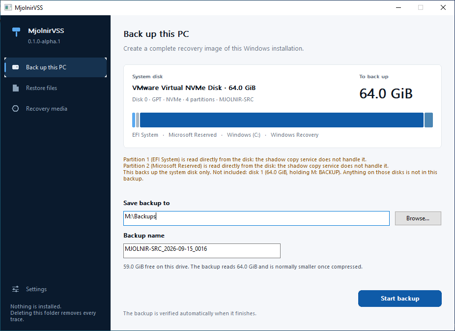
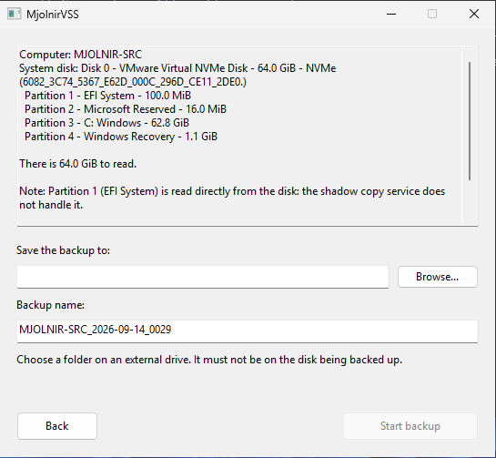
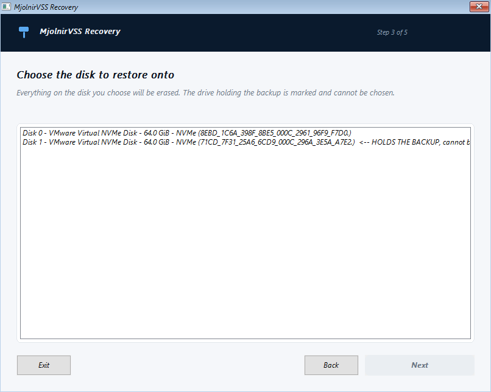
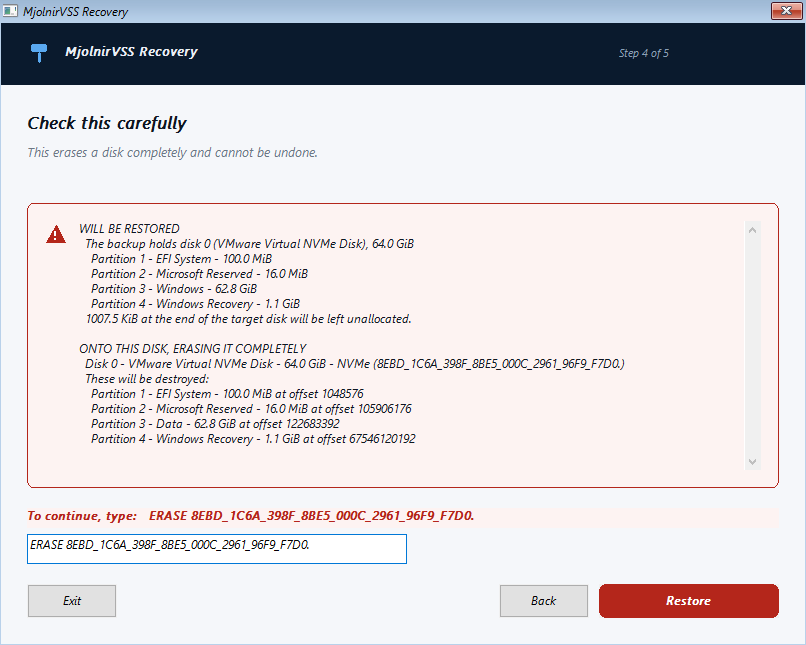
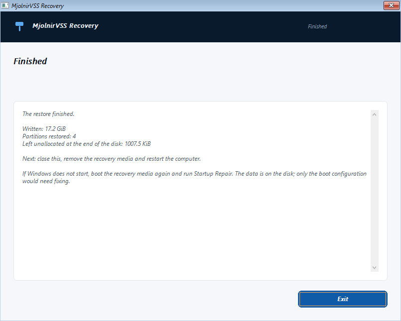

# MjolnirVSS

Portable bare metal backup and recovery for Windows 10, Windows 11 and Windows Server.

---

## Status: `0.1.0-alpha.1`. Tested in virtual machines, never on real hardware.

What changed, and what this alpha does and does not do:
[`CHANGELOG.md`](CHANGELOG.md).

**A restored Windows has now been booted from a MjolnirVSS backup.** On
13 September 2026, in a disposable VMware virtual machine: a live backup of a
running Windows 11, taken through the shadow copy service with used block
imaging; recovery media built by MjolnirVSS from this computer's own Windows
parts; the backup restored onto a blank 64 GB disk from that media, driven from
the keyboard in Windows PE; and the machine started on its own, with no repair.

Everything the restored machine was checked for came back right: all twelve test
files matched the hashes taken when they were made, every partition kept its
unique identifier, offset and size, the EFI partition held its boot files, the
boot configuration named the Windows loader, and the Windows Recovery
Environment was still registered.

That cycle has since been run many times over: onto a disk the same size and a
larger one, from an encrypted backup, from a BitLocker protected machine, and
after a restore was deliberately broken so the boot repair had to be the thing
that fixed it. Every one of them was a virtual machine.

**No real computer has been restored.** Firmware differs, disks differ, and a
virtual NVMe disk is not a Samsung one. Treat MjolnirVSS as something to test on
a machine you can afford to lose, and keep another backup.

What that means in practice is set out honestly below, feature by feature.

---

## What it does

MjolnirVSS takes an image of a whole Windows system disk while Windows is
running, stores it on an external drive as ordinary files, and can write it back
onto a blank replacement disk after the original has failed.

- **Nothing is installed.** Download, extract, run. No service, no driver, no
  scheduled task, no registry entries, no .NET, no runtime of any kind. Deleting
  the folder removes every trace.
- **The computer stays usable** while the backup runs. Microsoft's Volume Shadow
  Copy Service freezes the disk for the instant it takes to start the snapshot,
  and the copy is taken from that frozen view.
- **Every partition needed to boot is captured**: the GUID partition table, the
  EFI system partition, the Microsoft Reserved partition, Windows, and the
  recovery partition. A partition is never silently left out; if one cannot be
  read, the backup fails rather than quietly producing a disk that will not
  start.
- **Free space is not copied.** MjolnirVSS asks the filesystem which clusters are
  in use and reads only those, so a half empty drive makes a half sized backup. A
  volume that will not answer is copied whole instead, and the backup records
  that it had to.
- **The backup is verified before it is called a backup.** Every stored piece is
  read back, decompressed and checked against its BLAKE3 checksum. Only then is
  the completion marker written. A backup that was interrupted is never reported
  as usable.
- **The format is documented and open.** A backup is a plain folder of JSON and
  compressed blocks. See [`docs/backup-format.md`](docs/backup-format.md), which
  contains enough detail to write an independent reader.

---

## Where each feature actually stands

| Feature | State |
|---|---|
| Consistent live backup using VSS | **Implemented**, proven against a real Windows 11 machine, encrypted and not |
| Capturing the full GPT layout, EFI, MSR, Windows and recovery partitions | **Implemented**, tested against synthetic disks |
| Used block imaging: skipping free space on NTFS volumes | **Implemented**, proven on a real Windows volume: 14.2 GiB read out of a 62.8 GiB partition, and the result restored and booted |
| Warning before a backup may cost you restore points | **Implemented and measured** on a real machine |
| Verification: decompress and checksum every block | **Implemented and tested**, including against deliberately damaged backups |
| Restoring onto a blank disk | **Implemented**, done from real recovery media onto blank virtual disks of the same size and of a larger size, and both booted |
| Rebuilding the partition table on the replacement disk | **Implemented**, and the restored table checked partition by partition against the original |
| Refusing unsafe restore targets | **Implemented and tested** |
| Stopping cleanly with Ctrl+C | **Implemented and proven**: a real backup interrupted mid copy exits `9 cancelled`, releases the shadow copy it was holding, and leaves nothing marked complete |
| Graphical interface for backup | **Implemented**, not yet tested by anyone but its author |
| Graphical recovery wizard | **Implemented**, run in real Windows PE and driven through a whole restore with no mouse at all |
| **Booting a restored Windows** | **Done repeatedly, in virtual machines**: same size disk and larger, plain and encrypted, and once only because the boot repair fixed it. Never on real hardware |
| Repairing UEFI boot configuration after a restore | **Implemented and proven.** A restored disk was deliberately broken so it would not start, and the repair is what made it start again |
| Restoring individual files from a backup | **Implemented**, proven against a real Windows volume out of a real backup |
| Creating recovery media | **Implemented** where the Windows ADK is installed, and the media it makes has been booted |
| BitLocker: unlocked volume | **Implemented and measured.** See [`docs/bitlocker.md`](docs/bitlocker.md) |
| BitLocker: locked volume | **Refused**, clearly |
| Encrypting a backup | **Implemented**, and taken all the way round: an encrypted backup of a running Windows 11, restored from recovery media and booted. Argon2id and AES-256-GCM, nothing home made. The recovery wizard asks for the password; the backup window does not offer encryption yet. See [`docs/encryption.md`](docs/encryption.md) |
| Incremental backups | Not implemented, and deliberately not started until the above works |

---

## Requirements

- Windows 10, Windows 11 or Windows Server, 64 bit. **Windows 10 22H2, Windows
  11 24H2, Server 2019 and Server 2025 have each been backed up, restored and
  booted**, all in virtual machines. See
  [`docs/supported-configurations.md`](docs/supported-configurations.md)
- A UEFI machine with a GPT system disk
- One physical disk holding Windows
- An external drive formatted NTFS, with room for the backup
- Administrator rights (MjolnirVSS asks when it starts)

**Not supported**, and refused with an explanation rather than attempted:
dynamic disks, Storage Spaces, software RAID, ReFS system volumes, machines that
boot in legacy BIOS mode, Windows spread across several disks, and disks with an
untested sector size.

### Restore points

Taking a shadow copy can cost you older ones. Windows keeps a volume's shadow
copies in one pool and can only release space from the oldest end, so when
MjolnirVSS removes the temporary snapshot it took, Windows sometimes removes
older ones first to reclaim the space. This was measured on a real machine, and
it happens to any program that takes a snapshot, not only this one.

MjolnirVSS removes only the snapshot it created, by its own identifier. It says
so before the backup starts when there is anything to lose, shows the figures
behind **Show details**, and does not claim your restore points will survive,
because it cannot.

Your files are not affected. See
[`docs/vss-lifecycle.md`](docs/vss-lifecycle.md).

### BitLocker

**An unlocked BitLocker volume is backed up normally.** MjolnirVSS reads it
through its shadow copy, which presents it decrypted, so the backup holds an
ordinary NTFS filesystem. This was measured rather than assumed; the evidence is
in [`docs/bitlocker.md`](docs/bitlocker.md) and you can reproduce it with
`MjolnirVSS.exe diagnose-bitlocker`.

A **locked** volume is refused, because nothing can read it.

Two things follow, and MjolnirVSS says both rather than leaving them implied:

- **The backup contains readable copies of your files.** BitLocker does not
  protect them once they are out of the volume. Unless you pass `--encrypt`,
  nothing else does either, so look after the backup drive as carefully as the
  computer. See [`docs/encryption.md`](docs/encryption.md).
- **A restored disk comes back unencrypted.** BitLocker protection does not carry
  over, and this has been checked rather than assumed: a fully encrypted machine
  was backed up, restored and started, and the restored volume reported itself
  fully decrypted with no key protectors at all. Turn BitLocker on again after
  restoring.

MjolnirVSS never reads, stores or logs a recovery key, and never changes
BitLocker's state.

---

## Taking a backup



Five things. That is the whole window, and it is deliberate: the day you need a
backup program is not the day to start reading its manual. Each one says what it
does, so nothing has to be guessed at or looked up.

1. Plug in the external drive.
2. Run `MjolnirVSS.exe`. Windows asks for permission; say yes.
3. Press **Back up this PC**.
4. Check what it found, choose the folder to save into, and press **Start backup**.
5. Wait. The backup verifies itself at the end.



It shows you what it found before it does anything: the disk, every partition on
it, how much there is to read, and any note worth having, such as a partition the
shadow copy service will not handle. **Start backup** stays greyed out until you
have chosen somewhere to put it, and it will not let that somewhere be the disk
being copied.

The backup lands in a folder named after the computer and the time, for example
`DESKTOP-1A2B_2026-09-12_1015`.

### From a command prompt

The window is the product; these exist for testing, diagnostics and scheduled
backups.

```powershell
MjolnirVSS.exe inspect
MjolnirVSS.exe backup --destination E:\Backups
MjolnirVSS.exe backup --destination E:\Backups --encrypt
MjolnirVSS.exe verify E:\Backups\DESKTOP-1A2B_2026-09-12_1015
MjolnirVSS.exe list E:\Backups
MjolnirVSS.exe cleanup-snapshots
MjolnirVSS.exe diagnose-bitlocker
```

`--preview <bytes>` captures only the first part of each partition, so the whole
pipeline can be exercised in seconds. A preview backup is marked as such and can
never be restored.

MjolnirVSS never registers a scheduled task. If you want backups on a schedule,
create the task yourself and point it at the `backup` command above.

### Made to be driven by something that is not a person

Every command takes `--json` and prints one document on standard output -
**failures included**, with the exit code inside it. Progress goes to standard
error and never pollutes the JSON. Nothing stops to ask a question: an encrypted
backup takes `--password-file`, a restore takes `--confirm`, and a command that
would otherwise have to ask refuses and names the flag rather than hanging.

```powershell
$out  = MjolnirVSS.exe --json list E:\Backups
$code = $LASTEXITCODE
if ($code -ne 0) { throw ($out | ConvertFrom-Json).error.what }
```

Exit codes are a contract: `0` worked, `6` the backup is damaged, `7` the
destination is wrong, `9` cancelled, and so on. The full table, the failure
document, and a whole scheduled backup are in
[`docs/automation.md`](docs/automation.md).

---

## Checking a backup

```powershell
MjolnirVSS.exe verify E:\Backups\DESKTOP-1A2B_2026-09-12_1015
```

This reads every stored block, decompresses it and compares its checksum. It
exits with code 0 if the backup is sound and 6 if it is not.

A backup is verified automatically when it is taken. Verifying again later is
worth doing, because the thing most likely to damage a backup is the drive it is
sitting on.

---

## Getting a single file back

You do not have to restore a whole computer to get one file. Press **Restore
files**, choose the backup, choose the drive inside it, browse, and press
**Copy out...**

Nothing is erased and nothing is mounted. The backup is opened read only.

```powershell
# which drives are inside this backup
MjolnirVSS.exe volumes E:\Backups\DESKTOP-1A2B_2026-09-12_1015

# what is in a folder
MjolnirVSS.exe browse E:\Backups\DESKTOP-1A2B_2026-09-12_1015 `
    --volume disk-0-part-3 --folder \Users\tobias\Documents

# copy it out
MjolnirVSS.exe extract E:\Backups\DESKTOP-1A2B_2026-09-12_1015 `
    --volume disk-0-part-3 --item \Users\tobias\Documents --into D:\Recovered
```

Add `--json` to any of them for output a script can read. Details:
[`docs/file-recovery.md`](docs/file-recovery.md).

---

## Recovering a computer

### First, make the media, while the computer still works

Press **Recovery media** in the main window, or:

```powershell
MjolnirVSS.exe recovery-media --iso E:\MjolnirVSS-Recovery.iso
```

MjolnirVSS builds it out of the Windows recovery parts your own computer
already has. Nothing belonging to Microsoft is shipped or downloaded. Write the
ISO to a USB stick with any tool that writes a bootable image. Do this **before**
you need it: a computer that will not start cannot build its own rescue disc.

Needs the Windows ADK installed. Details and the reason:
[`docs/recovery-media.md`](docs/recovery-media.md). Without the ADK, copy
`MjolnirVSS.Restore.exe` onto a Windows installation USB made with Microsoft's
Media Creation Tool, boot it, and press **Shift+F10** at Windows Setup for a
command prompt.

### Then, when the disk has failed

1. Boot the broken computer from that media. The recovery wizard starts on its
   own.
2. Follow the five steps: find the backup, choose it, choose the blank
   replacement disk, read what is about to be erased, and type the disk's
   serial number to confirm.

It works from the keyboard alone - Tab, arrows and Enter - which matters in
Windows PE on a machine whose mouse may not be the thing that still works.



**The drive holding the backup cannot be chosen.** Erasing it halfway through a
restore would leave a computer with neither a working system nor anything to
recover from, so it is refused rather than warned about.



Before anything is erased you are shown the disk number, model, serial number,
size and every partition currently on it, and you have to type

```text
ERASE <the disk's serial number>
```

exactly. It will not accept `y`. Then it asks once more, naming the disk.



It also refuses a disk too small to hold the layout, checks every stored block is
present **before** it erases anything, and stops if the disk changed size between
being checked and being written.

Full walkthrough: [`docs/bare-metal-restore.md`](docs/bare-metal-restore.md).

---

## Test your recovery before you trust a backup

This is not boilerplate. A backup you have never restored from is a guess about
the future.

The way to find out whether MjolnirVSS works for your machine is to restore one
of its backups onto a spare disk, or into a virtual machine, and see whether
Windows starts. Until you have done that, keep whatever backup you were using
before.

---

## Building

Needs the stable Rust toolchain and the Visual Studio C++ build tools.

```powershell
rustup target add x86_64-pc-windows-msvc
cargo build --release --workspace
cargo test --workspace
.\scripts\package.ps1
```

`package.ps1` produces `dist\MjolnirVSS`, which is the portable folder. It also
checks that the recovery executable does not import `vssapi.dll`, because that
library does not exist in Windows PE.

The release build links the C runtime statically, so the Visual C++
Redistributable is not required.

---

## Documentation

| Document | What it covers |
|---|---|
| [`docs/architecture.md`](docs/architecture.md) | How the pieces fit together and why |
| [`docs/backup-format.md`](docs/backup-format.md) | The on disk format, in enough detail to reimplement |
| [`docs/vss-lifecycle.md`](docs/vss-lifecycle.md) | How the shadow copy is taken and released |
| [`docs/bitlocker.md`](docs/bitlocker.md) | How BitLocker is handled, and the measurement behind it |
| [`docs/bare-metal-restore.md`](docs/bare-metal-restore.md) | Recovering a computer, step by step |
| [`docs/encryption.md`](docs/encryption.md) | Encrypting a backup, what it hides and what it does not |
| [`docs/recovery-media.md`](docs/recovery-media.md) | Making bootable media out of the Windows parts this computer already has |
| [`docs/file-recovery.md`](docs/file-recovery.md) | Getting single files back out of a backup |
| [`docs/supported-configurations.md`](docs/supported-configurations.md) | Exactly what is supported and what is refused |
| [`docs/testing.md`](docs/testing.md) | How to run the tests, including the manual matrix |
| [`docs/vm-testing.md`](docs/vm-testing.md) | The virtual machine harness that proves the whole cycle |
| [`docs/threat-model.md`](docs/threat-model.md) | What MjolnirVSS treats as hostile, and what it does not defend against |
| [`docs/automation.md`](docs/automation.md) | Driving it from a script: exit codes, JSON output, nothing that waits for a person |
| [`docs/roadmap.md`](docs/roadmap.md) | What comes next, in order |

---

## Licence

GPL-3.0-or-later. See [`LICENSE`](LICENSE).

MjolnirVSS is an independent, clean room implementation. It is not derived from,
and does not interoperate with, any commercial backup product. It uses
documented Microsoft interfaces and a backup format designed for this project.
